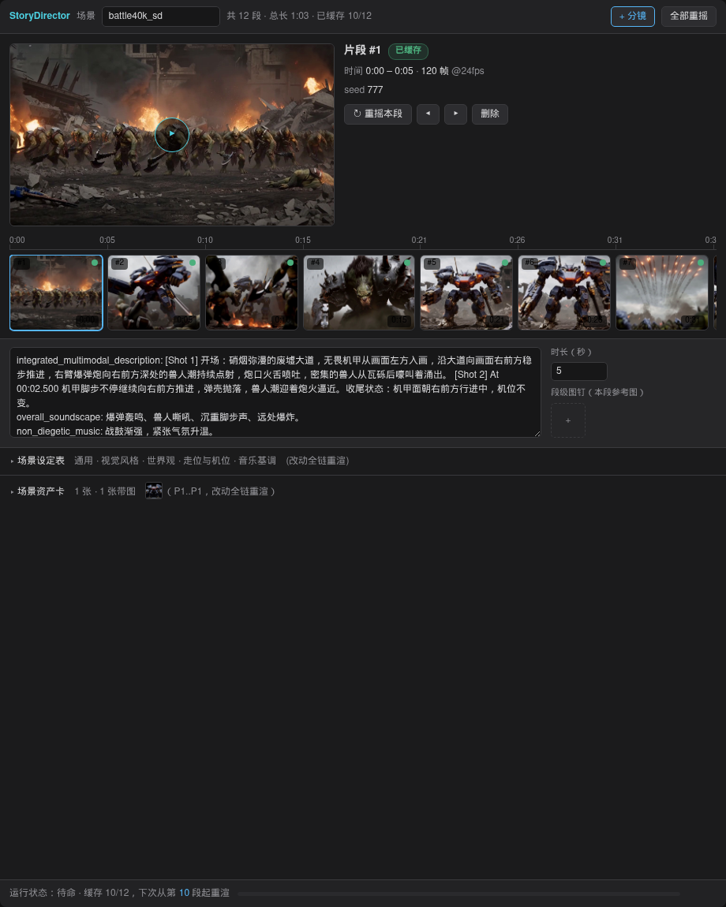

# ComfyUI-H3-SceneDirector

MiniMax H3 的**场景导演**工作台：以"场景 / 动作"的心智模型做长视频——一次 run 是一个**场景**（物理上是连续镜头），每段是场景里的一个**动作**。逐段增量渲染，段间用**特征上下文窗口衔接技术**真正延续画面与声音。



## 分层模型：故事 / 场景 / 动作

```
故事（Story） = N 个场景的硬切组接        ← 路线图上的上层（见下）
场景（Scene） = 一个 run，窗口衔接保连续   ← 本包的内核
动作（Action）= 一个 segment              ← 工作台时间线上的一张分镜卡
```

电影语言里场景之间本来就该**硬切**——跨场景走 latent 连续反而是错的（谁也不希望竹林渐变进装配舱）。所以场景级连续性（我们的内核）和故事级组接（合片）是两个问题，本包先把前者做到位。

**当前版本定位：场景级工作台。** 故事级编排（多场景管理、跨场景资产复用、硬切合片导出）在路线图上。

> 兼容说明：节点类 ID 保持 `H3SceneDirector*` 不变，存量工作流不受影响；从 SceneDirector 时代升级的请先删除旧包目录再装（类 ID 相同，同装会冲突）。

## 特性

- **分镜时间线工作台**（`H3SceneDirectorList` 节点）：场景设定表、资产卡（角色/场景/物品，图片自动编号 `<Picture N>` 注入每段条件）、胶片分镜轨道（缩略图、缓存状态徽标、单段重摇、排序、段内视频点播）、实时渲染进度、逐步实时预览（latent 投影，零解码开销）、可拉拽布局
- **特征上下文窗口衔接**（运动上下文链接）：上一段交付尾部最多 39 帧经 VAE 压成 latent 特征窗口，作为永不去噪的条件块钉进下一段时间轴——模型读到的是真实的**运动**而不是一张末帧静照；尾部声音钉在同一条时间轴上，相位级延续（详见下文实现原理）
- **增量重渲**：每段缓存到 `output/h3_scenedirector/<run>/`（AV latent + mp4 + 海报），内容寻址：改哪段渲哪段，第一个变动段之后级联；改全局设定/资产全链重渲
- **反上帝节点**：采样完全走接线——`model`（可串 Spectrum 等补丁）、`sampler`、`sigmas`、可选 `negative`+`cfg`。文本编码在独立的编码头里完成，CLIP 层优化随意插
- **精确时长**：写 5s 交付 5s。VAE 网格对齐产生的盈余帧只参与下一段的上下文，交付按设定帧数裁切，连续性锚定在实际交付的尾部——接缝无洞
- **颜色锁定**（可选）：逐帧滑动统计校色，压制逐段独立渲染的白平衡/曝光漂移；锁机位恒定光照的片子（口播/装配）建议开，光照需要渐变的片子请关
- 与同生态旧包同装时补丁带认领养守卫，不会叠加

## 运动上下文（Motion Context）实现原理

### 问题

H3 单次只能生成几秒。把长片切成多段后，最直观的接法是"上一段末帧 → 下一段 i2v 首帧"。但单帧不携带运动信息：速度、方向、机位运动全靠模型从文本重新猜，表现为接缝处动作断裂、机位瞬移、角色漂移。官方关键帧条件又只接受第 0 帧和最后一帧两个锚点，任意中间位置会被直接拒绝。

### H3 的序列布局（坐标算术）

H3 的 DiT 把所有内容打包进一条序列：文本行 / 条件行（关键帧）/ 参考块行 / 目标视频行 / 目标音频行，每一行在 `position_ids` 里携带时间坐标，RoPE 由这些坐标构建。两个关键常量：

- `FRAME_PER_TOKEN = (1, 4, 4, 4, 4)`：视频 VAE 的时间压缩模式，每 5 个 latent 步覆盖 17 帧（所以帧数网格是 17k+5）
- `FRAME_RESCALE = 5/3`：像素帧到时间坐标的缩放（音频 latent 40Hz 对画面 24fps）

由这两个常量可推出**任意像素帧 p 的时间坐标通项** `text_len + FRAME_RESCALE · p`——官方首/尾帧两个分支只是它的特例。这就是任意位置锚定的数学基础。

### 布局补丁（core/patch_layout.py）

不改官方源码，包一层 `PackedLayout.__init__`：钉帧先以恒合法的 `resolved_frame_index=0` 交给原版构造，真实像素位置经 `motion_context_index` 标记随行携带；构造返回后、RoPE 构建前，把这些 cond 行的时间列改写为通项坐标。两个细节：

1. **参考块游标补偿**：参考块（角色定妆照等）排在目标内容之前，会把目标原点从 `text_len` 往后推（图片块 +1.0，音频块 +ref_audio_t）。钉帧坐标必须加上这个位移，否则加参考图后锚点与目标画面错位。
2. **音频行时间轴平移**：官方把参考音频放在片段之前的坐标区，模型读到的是"另一段可模仿的素材"（音色相近但相位无关）。我们把钉帧音频的行整体平移到本片自己的时间轴、与钉帧视频窗口末尾对齐（`motion_context_audio_end_frame`），模型于是把它读作"本片到目前为止的声音"并**相位连续地**续写。

补丁应用前会做完整自检（首/尾帧逐位对齐官方、内部锚点递增、游标补偿不变量、音频平移均匀性、多参考块隔离），上游 ComfyUI 一旦改变布局算术，自检失败、补丁拒绝应用——宁可报错也不静默产出错位画面。另有载荷补丁（core/patch_payload.py）修复官方 `extra_conds` 中参考块分支覆盖关键帧 latent 的问题（改为合并），两者共同支撑"钉帧 + 参考图 + 钉音频"三者共存。

### 视频钉帧（core/motion_context.py）

取上一段尾部 n 帧（默认 22，最大 39 ≈ 1.6s 运动记忆）：

- `video` 模式：一次 VAE 调用把整段尾帧编为 latent——时间维被压进 latent step，**帧间运动信息保留在 latent 内部**，22 帧压成 7 个条件块、39 帧 12 块，远比逐帧钉省条件行
- 帧数先向下吸附到 `VIDEO_RUN_GRID (39, 22, 5, 1)`：网格间的帧数编出的步数与较小网格点相同、但只覆盖输入的**前**若干帧——不吸附会让钉住的尾巴提前结束、接缝错位
- `head` 模式钉在新片段的 0..span 索引，生成的输出包含这段钉帧，解码后裁掉（trim），裁切音画同步并修掉音频网格的 ~8ms 尾部盈余，避免接缝漂移逐链累积

### 交付尾部锚定与精确时长

渲染窗口必须向上对齐到 17k+5 网格（5s+39 帧 → 实际渲 175 帧）。交付时按设定时长裁到精确帧数；**连续性锚定在实际交付的尾部**而非完整渲染的尾部——被裁掉的盈余帧只作为渲染余量存在，不进入连续链。这是接缝无跳帧的关键不变量：下一段钉住的尾巴 === 观众在本段看到的结尾。

### 增量缓存

每段渲染产物落盘 `output/h3_scenedirector/<run>/`（无损 AV latent + mp4 + 海报 + meta.json）。段指纹 = 序号 + 时长 + 提示词 + nonce + 段级资产指纹；全局指纹 = 设定表 + 资产文件 sha1 + 采样指纹（sampler 名 + sigmas 哈希 + negative/cfg）+ 显式 seed + cache_tag。自第一个变动段起级联重渲（后段钉前段的尾帧，前段变则后段条件变），未变段直接读盘——改第 8 段只重渲 8 到 N。

### 颜色锁定（storyline/colorlock.py）

逐段独立渲染时，模型会对曝光与白平衡做微小的重新决策，多段串联累积成可见的变色。开启 `color_lock` 后，每段交付前按**逐帧滑动统计**对齐到第 1 段：增益整段对齐对比度，偏移按每帧均值的滑动平均逐帧钉参考——窗口（~0.5s）内的动作内容原样通过，窗口外的慢漂移压平，接缝两侧统计天然连续。

## 节点

| 节点 | 职责 |
|---|---|
| H3 Scene Director List | 工作台载体：场景设定表 + 资产卡 + 分镜时间线 |
| H3 Scene Director Conditioning | 逐段条件编码（CLIP/VAE 接线，明面可见可 hack） |
| H3 Scene Director Chain | 特征上下文窗口衔接引擎：钉帧 → 采样 → 解码 → 缓存 → 拼接 |
| H3 Scene Director Latent Template | 统一渲染窗口的空 AV latent（MultiRate 类采样器用） |

## 安装

```bash
cd ComfyUI/custom_nodes
git clone https://github.com/Huterox/ComfyUI-H3-SceneDirector
# 重启 ComfyUI
```

依赖 ComfyUI 原生 MiniMax H3 支持（模型见 [Comfy-Org/MiniMax-H3](https://huggingface.co/Comfy-Org/MiniMax-H3)）。

示例工作流在 `example_workflows/`：

- `scenedirector_t2v_workbench.json`：最小工作台（英文示例剧本）
- `scenedirector_t2v_battle_demo.json`：完整战斗长片示例（中文剧本、完整排线）。它引用了参考图 `dreadnought_ref.jpg`——**请先把这张图复制到 ComfyUI 的 `input/` 目录**（或在工作台资产卡里换成你自己的图）

## 提示词协议（承接句写法）

钉帧只带约 1.6 秒的运动记忆，跨段的运动/走位/机位逻辑靠文本维持：

1. 设定表加一行固定的**走位与机位**（方向/机位全片统一）
2. 每段开头写 `承接上段：…`（继承的运动/机位状态），结尾写 `收尾状态：…`
3. 段内只写增量动作；要切镜头就显式写"切镜头"并重新建立场景
4. 参考图管身份不管运动——资产图别放姿势感太强的

## 测试

```bash
python tests/test_patch_layout.py  # 布局补丁语义（纯 CPU 离线）
python tests/test_smoke.py         # 节点注册 + 运动上下文 + 裁剪（纯 CPU 离线）
python tests/test_colorlock.py     # 颜色锁定（纯 CPU 离线）
```

## 许可

Apache License 2.0。
