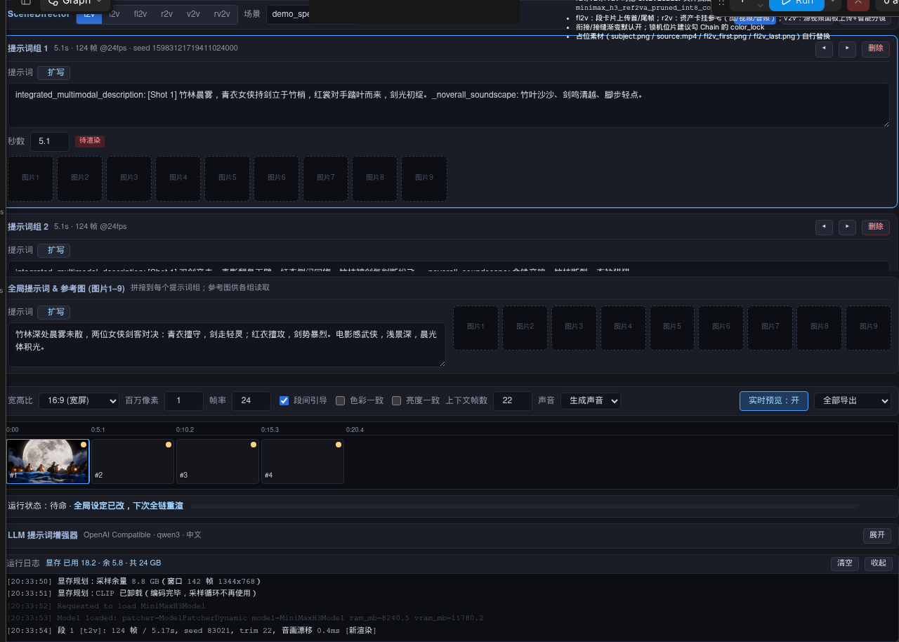
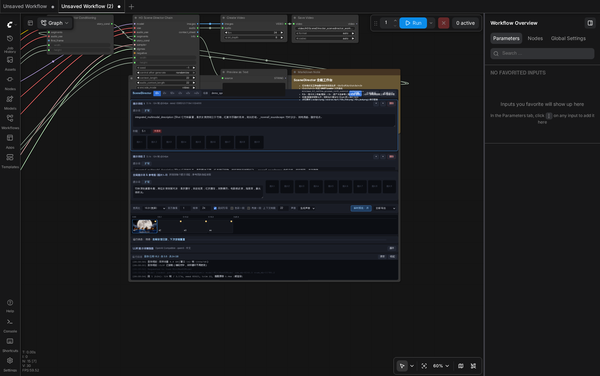
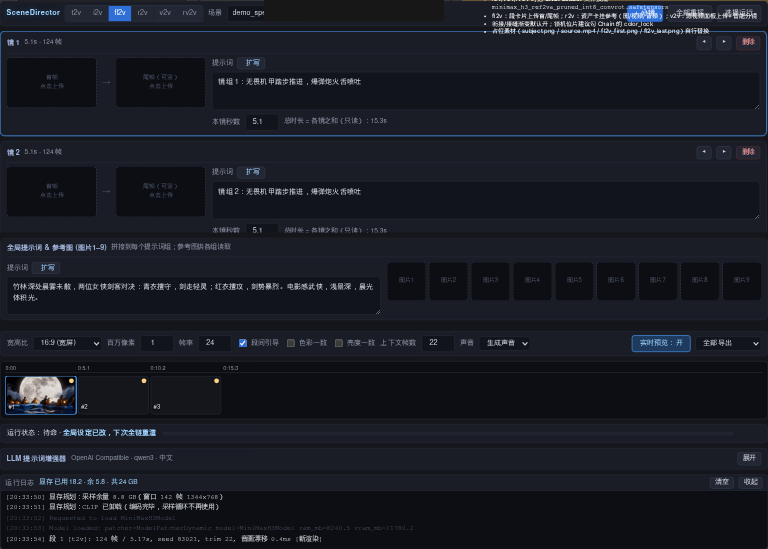
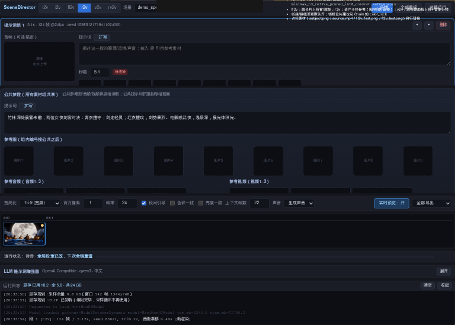
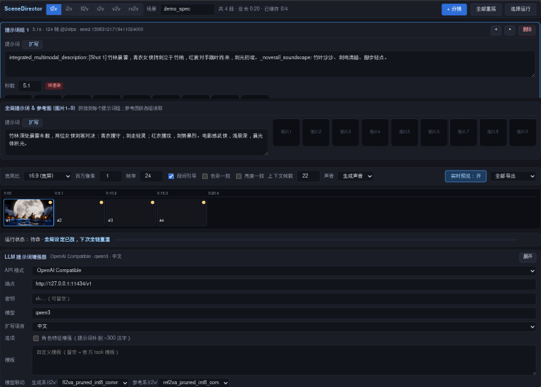

# ComfyUI-H3-SceneDirector

MiniMax H3 的**场景导演工作台**：把一个场景拆成多段分镜，逐段渲染、latent 级首尾相接，
拼成长镜头连贯视频。功能对齐 Director 生态（多任务模式 / 选择运行 / 智能分镜 /
提示词增强），差异点是**特征上下文窗口衔接**、**色彩/亮度双层一致性**、
**H3 专项显存规划**，以及**可组合节点架构**——不做上帝节点，model / sampler /
sigmas 全部走接线，Spectrum 等加速节点即插即用。

## 目录

- [特性一览](#特性一览)
- [界面](#界面)
- [节点](#节点)
- [快速开始](#快速开始)
- [特征上下文窗口衔接（原理）](#特征上下文窗口衔接原理)
- [H3 专项显存规划](#h3-专项显存规划)
- [一致性三层](#一致性三层)
- [缓存与增量重渲](#缓存与增量重渲)
- [致谢](#致谢)

## 特性一览

**任务模式（工作台页签切换，每模式独立数据舱）**

| 模式 | 说明 |
|---|---|
| t2v | 文生视频：全局设定 + 逐段提示词 |
| i2v | 图生视频：段级源图钉首帧 |
| fl2v | 首尾帧镜组：每镜首帧/尾帧（可只给尾帧） |
| r2v | 参考主体：公共参考图 1–9 / 音频 1–3 / 视频 1–3，组内编号接续 |
| v2v | 视频转视频：源片段区间 + 声音模式（生成/原声/静音） |
| rv2v | 源视频 + 参考素材混合编辑 |

**衔接与一致性**

- **特征上下文窗口衔接**（默认开）：上一段尾部帧 + 音频编码为 latent 条件钉入
  下一段注意力上下文，画面与声音真正续接而不是从静帧猜运动；关闭即官方原生逐段
- **色彩一致**（colorLock）：全片逐帧滑动校色，整段均值/方差对齐第 1 段，治变色
- **亮度一致**（lumaLock）：逐段平均亮度归一（Rec.601，比例夹 0.55–1.8），
  只稳亮度不动色相
- **接缝亮度渐变 + 回声诊断**：接口不跳变；两开关不动 latent，翻转只重存工件不重渲

**工程**

- **H3 专项显存规划**（默认开）：采样激活按段长/分辨率/钉帧/参考图预估，
  运行时压低 DiT 权重驻留（DynamicVRAM 异步预取补缺）；H3 VAE 解码内存估算
  修正为内建滑窗流式口径；编码完成主动卸载 CLIP——高分辨率长段从崩溃边缘
  变确定性运行
- **级联失效缓存**：全局/逐段内容指纹，改哪段只从哪段起重渲；
  选择运行（勾选渲染、未选缓存填充）；`run 名` 即缓存目录，换名开新场景
- **运行日志条**：显存读数（已用/余/共）+ 模型装卸明细（含 DETAIL 级
  `Model loaded ram_mb/vram_mb`、`AIMDO free`）+ 逐段耗时与音画漂移
- **段间 VRAM 清理**（可选开关）：极限显存换稳定

**工作台 UI（v2 自研前端）**

- 提示词组卡：逐段提示词 + 秒数（帧网格吸附）+ seed + 段级参考图槽 1–9
- fl2v 镜组卡、r2v 公共参数面板、v2v 舞台播放器 + 段时间轴
  （拖缘调区间 / 智能分割 / 均分 / 追加视频）
- 缓存胶片带：绿/橙/红状态点 + 点播任一段；实时预览（逐步 latent 投影）
- 每段魔法棒 LLM 扩写（内联预览-确认-应用，OpenAI 兼容 / Anthropic 端点，
  配置随工作流保存）；提示词输入 @ 引用补全
- 模型联动：切模式自动切换 UNET（生成系/参考系可配，随工作流保存）；
  输出条宽高比/百万像素直驱图里的 ResolutionSelector
- 智能分镜：零依赖帧差切点检测（PyAV），一键把源视频切成 v2v 段

## 界面

整图工作流（Spec 加速示例）：工作台只是图里一个节点，采样配置全部走接线。

fl2v 首尾帧镜组：

r2v 公共参考面板（图/音/视分类）：

LLM 提示词增强器（端点/密钥/模板/模型联动）：

## 节点

| 节点 | 职责 |
|---|---|
| `H3SceneDirectorList` | 导演工作台（分镜时间线 UI），输出 SEGMENTS 载荷 |
| `H3SceneDirectorConditioning` | 逐段条件编码（CLIP/参考素材/首尾帧/源片段），输出 STORY_COND |
| `H3SceneDirectorChain` | 衔接引擎：钉帧 → 采样 → 解码 → 缓存 → 拼接 |
| `H3SceneDirectorLatentTemplate` | 统一渲染窗口模板（MultiRate T8 类采样器用） |

外部节点照常使用：`UNETLoader` →（可选 `SpectrumApplyMiniMaxH3`）→ Chain；
`CLIPLoader`（type=minimax）、`VAELoader` ×2（视频 + 音频）、`ResolutionSelector`、
`KSamplerSelect`、`BasicScheduler`。

## 快速开始

1. 把本包放进 `ComfyUI/custom_nodes/`，重启 ComfyUI
2. 准备模型：

| 用途 | 文件 | 目录 |
|---|---|---|
| UNET（t2v/i2v/fl2v） | `minimax_h3_fl2va_*_int8_convrot.safetensors` | `models/diffusion_models/` |
| UNET（r2v/v2v/rv2v） | `minimax_h3_ref2va_*_int8_convrot.safetensors` | `models/diffusion_models/` |
| CLIP | `qwen3vl_32b_minimax_h3_nvfp4_awq.safetensors` | `models/text_encoders/` |
| VAE | `minimax_h3_video_vae_fp16` + `minimax_h3_audio_vae_fp32` | `models/vae/` |

3. 拖入示例工作流（`example_workflows/`，LLM 配置均为空密钥本地端点，按需自填）：

| 文件 | 说明 |
|---|---|
| `场景导演工作台.json` | 全能工作台：六模式页签切换；r2v/v2v/rv2v 自动联动 UNET 为 ref2va |
| `场景导演工作台_Spec加速.json` | 同款 + Spectrum 加速节点（UNETLoader→Spectrum→Chain/Scheduler） |

4. 工作台里写全局设定与逐段提示词，点 Run。产物与增量缓存在
   `output/h3_scenedirector/<run名>/`（latent + poster + 分段 mp4）。

## 特征上下文窗口衔接（原理）

一次性合成长视频受显存所限不可行，逐段独立渲染又会画面跳变、声音断裂。
SceneDirector 的解法是**把上一段的"结尾状态"变成下一段的"已知条件"**，而不是
只递一张静帧让模型猜运动：

1. 上一段渲染完成后，取其**交付视图**（裁掉钉帧头、修齐音画网格之后的实际
   输出）尾部 n 帧像素与尾部波形；
2. 尾帧经视频 VAE 编码为一串 latent 条件块，尾音经音频 VAE 编码为音频步，
   两者钉入下一段打包序列的时间轴头部（`head` 模式），时间坐标精确对齐；
3. 条件块以噪声增强钉在 t≈1（永不去噪），DiT 注意力把它读作"已经发生的
   历史"——画面内容、运动矢量、声音节拍同时续接；
4. 采样完成后裁掉钉帧头（trim 与音频同步裁切），只交付新内容；
5. 帧数对齐 H3 视频 VAE 的因果卷积网格（像素帧 17k+5，latent 步
   `(n-5)//17*5+2`），钉帧内容与时间坐标严格一致，错位宁可拒绝运行。

缓存按内容指纹级联失效：每段 latent 落盘，改动第 k 段只从第 k 段起重渲
（其后的段依赖它的尾部，必须级联）；未改段直接从缓存解码拼接。

## H3 专项显存规划

ComfyUI 的 DynamicVRAM（comfy-aimdo）已提供逐块异步换入换出（vbar pinned
offload + 模型 forward 内 prefetch 双缓冲），但默认策略是"权重能装多少装多少"，
高分辨率长段时采样激活一顶上来就被动抖动。本插件在节点侧补上了它缺的规划层：

- **采样激活预估**：段长、分辨率、钉帧窗口、参考图数量在采样前全部已知，
  按打包序列长度估算激活峰值（`seq_len × 70KB + 固定余量`，保守方向）；
- **权重驻留压缩**：采样期间临时抬高全局显存保留量（`--reserve-vram` 的
  运行时等价物），把 DiT 权重驻留压到安全额度，缺口由 prefetch 流水线
  异步补——边缘抖动换成确定性运行，代价是每步少量权重搬运；
- **VAE 解码估算修正**：H3 视频 VAE 内建 17 帧时间滑窗 + 空间 tile，解码本是
  流式的，通用估算公式却按整段线性高估几十 GB，导致每段解码前无谓往返
  20G 权重；插件把估算换成符合内建分块行为的真实口径；
- **CLIP 主动卸载**：编码头完成全部段条件后，文本编码器即卸载清场。

全部通过 ModelPatcher / model_management 公开接口完成，不修改 ComfyUI 核心，
可用 Chain 节点的 `vram_budget` 开关整体关闭回到原生行为。

## 一致性三层

| 层 | 开关 | 机制 | 治什么 |
|---|---|---|---|
| 面 | 色彩一致 | 整段均值/方差通道对齐 + 逐帧滑动偏移（参考第 1 段） | 逐段渲染的白平衡/曝光漂移、变色 |
| 面 | 亮度一致 | 整段平均亮度归一（Rec.601，比例夹 0.55–1.8，<1% 不动） | 只稳亮度，不动色相与对比度结构 |
| 缝 | 接缝渐变 | 开头几帧亮度向上一段尾巴线性衰减对齐 + 回声帧诊断 | 接口跳变 |

三者只修交付像素、不动 latent：开关翻转后对缓存段只重存 poster/mp4 工件，
不重渲染，可放心对比。光照需要渐变的片子（如结尾破晓）请关闭色彩一致，
否则渐变会被抹平。

## 致谢

- UI 与交互设计思路参考 [ComfyUI_MiniMaxH3_Director] 项目（Director 时间线
  工作台的产品形态）；
- 算法思路参考 [ComfyUI-H3-Motion-Context] 项目（运动上下文 / 特征上下文
  窗口衔接的问题定义与思路启发）。

本项目的全部代码（前端 v2、衔接内核 `core/`、工程层 `director/`）均为独立
实现，未搬运上述项目的源码。

## 许可证

Apache-2.0
